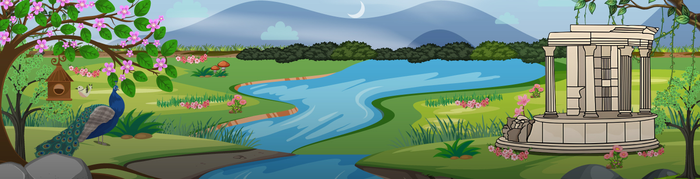

**Welcome to the 'Garden'**

*A place to share and collaborate on projects related to the "Garden" - where most of the fun stuff lives* 🙂

---

---

### 🌸 About

This organization houses a growing collection of libraries and tools of all kinds.  
A solo journey of creation, exploration, and continuous development.

### 🏛️ The Name

**Elysium** is a sacred realm in Greek afterlife myth, sometimes associated with or adjoining the underworld, where Hermes guides souls under the watch of Hades.  
A fitting name for a place of rest, reflection, and rebirth of ideas.

### 🌺 The Symbolism

**Gladiolus** → Strength and moral integrity
**Purple** → Creativity and imagination (plus it's easy on the eyes)

---

*Building something meaningful, one commit at a time*

